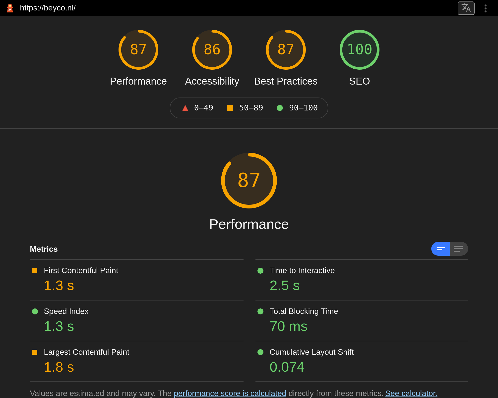

# Rapportage webtoegankelijkheid-test voor Beyco

Dit document is een template voor een webtoegankelijkheid-test volgens de Web Content Accessibility Guidelines (WCAG). Een consistente rapportage helpt bij het uitvoeren van een evaluatie en zorgt er voor dat verschilelnde tests kunnen worden vergeleken.

Datum webtoegankelijkheid-test: 28-10-2021

Webtoegankelijkheid-test uitgevoerd door: Daan Korver

## Inhoudsopgave
  * [Samenvatting](#samenvatting)
  * [Achtergrond bij de evaluatie](#achtergrond-bij-de-evaluatie)
  * [Afbakening](#afbakening)
  * [Beoordelaars](#beoordelaars)
  * [Beoordelingsproces](#beoordelingsproces)
  * [Testresultaten en aanbevelingen](#testresultaten-en-aanbevelingen)
  * [Bijlagen](#bijlagen)

## Samenvatting
Dit rapport beschrijft in hoeverre de website [beyco.nl](https://www/beyco.nl) overeenstemt met de Web Content Accessibility Guidelines (WCAG) van het W3C. Na de achtergrondinformatie en afbakening van de test worden beoordelaars, beoordelingsproces en testresulltaten beschreven.

Conslusie van deze test luidt dat de Beyco website niet voldoet de WCAG 2.1, op niveau AA. Gedetailleerde resultaten en aanbevelingen zijn verderop in dit document beschikbaar en in de referenties vindt u bronnen voor eventuele vervolgstudie. Wij stellen feedback op deze evaluatie zeer op prijs.

## Achtergrond bij de evaluatie
De webtoegankelijkheid-test vereist een combinatie van semi-geautomatiseerde en handmatig uitgevoerde evaluatie tools door een ervaren beoordelaar. De beoordelingsresultaten in dit rapport zijn gebaseerd op een beoordeling welke is uitgevoerd op 28-10-2021. De website kan ondertussen aangepast zijn.

## Afbakening
[beyco.nl](https://www.beyco.nl)

Beyco is een platform waarbij je je koffie kan kopen en verkopen.

URLs die mee zijn genomen in de beoordeling:
* [www.beyco.nl](https://www.beyco.nl)


Test data:
* 28-10-2021
* 29-10-2021

Taal: Nederlands

## Beoordelaars
Daan Korver  
Student  
daan.korver@hva.nl  
Nederlands


## Beoordelingsproces
Deze beoordelings is uitgevoerd op WCAG 2.1 Niveau AA

De tools die zijn gebruikt voor deze beoordeling zijn de volgende:
* [A11Y Checklist](https://www.a11yproject.com/checklist/)
* [WCAG Guidelines Overview](https://www.w3.org/WAI/standards-guidelines/wcag/)
* [Google Lighthouse](https://developers.google.com/web/tools/lighthouse)

## Testresultaten en aanbevelingen
{Samenvatting van testresultaten, bv. deze website {voldoet/ voldoet niet/ is dichtbij aan voldoen} aan de WCAG 2.1, op niveau A, AA of AAA.}
De huidige website van beyco voldoet niet nivea AA van de WCAG 2.1. Om deze score toch te behalen zijn er een paar aanbevelingen.

* Zorg dat labels de juiste attributen bevatten en dat er een duidelijke tekst in staat.
* Zorg dat het contrast van normale tekst een minimum ratio hebben van 4.5:1 en die van grote teksten een minimum 3:1
* Zorg dat alle elementen van de website altijd in beeld blijven, zelfs als je gaat zoomen.
* Zorg dat er geen horizontale scroll aanwezig is en dat de content niet naar de zijkant word gepushed op kleine schermen zoals Iphone 5
* Zorg dat er genoeg scroll ruimte is op mobile.

### Sterke punten
{Samenvatting van de de sterke punten ...}

### Ontoegankelijke punten
* Label elementen missen het ```for``` attribuut en bevatten geen tekst
* In de footer is er een input om jezelf in te schrijven voor de nieuwsbrief. Als je hier een verkeerd email adress invoerd krijg je een error. Het contrast van deze error is niet goed.
* Bij 200% Zoom gaan sommige elementen uit het beeld. Dit geld vooral voor het kopje van "Search for coffees"
* Het contrast van de groene en witte/grijze kleur is niet goed genoeg.
* Op kleinere telefoons zoals Iphone 5 is er aan de rechterkant witruimte die zich over de hele lengte van de site verspreid.
* Bij de sectie van "Search your coffees" is er niet genoeg ruimte voor de gebruiker om te scrollen. Het zou zo maar kunnen dat je perongeluk 1 van de bedrijven aanklikt waardor je weer terug moet gaan naar de vorige pagina.


### Checklist 

##### Content

##### Global code

##### Keyboard

##### Images

##### Headings

##### Lists

##### Controls

##### Tables

##### Forms
* All inputs in a form are associated with a corresponding  ```
<label>``` element.   
Label elementen missen het ```for``` attribuut en bevatten geen tekst
* Make sure that error, warning, and success states are not visually communicated by just color.  
Het contrast van de error is niet goed.

##### Media
n.v.t.

##### Video
n.v.t.

##### Audio
n.v.t.

##### Appearance
* Increase text size to 200%.  
Bij 200% Zoom gaan sommige elementen uit het beeld.

##### Animation
n.v.t.

##### Color contrast

* Check the contrast for all normal-sized text.  
De lichtgroene kleur(#679d90) op grijs(#ebf2f1) heeft een contrast ratio van 2.72. Dit is geen goeie standaard als het gaat over contrast. 
* Check the contrast for all large-sized text.  
Het zelfde geld weer met de lichtgroene en grijze kleur. Het contrast ratio is niet hoog genoeg.
* Check the contrast of borders for input elements (text input, radio buttons, checkboxes, etc.).  
Het contrast van de  focus van inputs(#61998b) die staan op bijvoorbeeld een groene achtergrond(#679d90) is slecht zictbaar. Dit geld ook voor andere achtergrond kleuren.

##### Mobile and touch

* Remove horizontal scrolling.  
Op kleinere telefoons zoals Iphone 5 is er aan de rechterkant witruimte die zich over de hele lengte van de site verspreid.

* Ensure sufficient space between interactive items in order to provide a scroll area.  
Bij de sectie van "Search your coffees" is er niet genoeg ruimte voor de gebruiker om te scrollen. Het zou zo maar kunnen dat je perongeluk 1 van de bedrijven aanklikt waardor je weer terug moet gaan naar de vorige pagina.

## Bijlagen

### Lighthouse Desktop
Dit is de huidige score van beyco zonder enige optimalisatie.


### Lighthouse Mobile
Dit is de huidige score van beyco zonder enige optimalisatie.


## Licentie


This work is licensed under [GNU GPLv3](./LICENSE).
